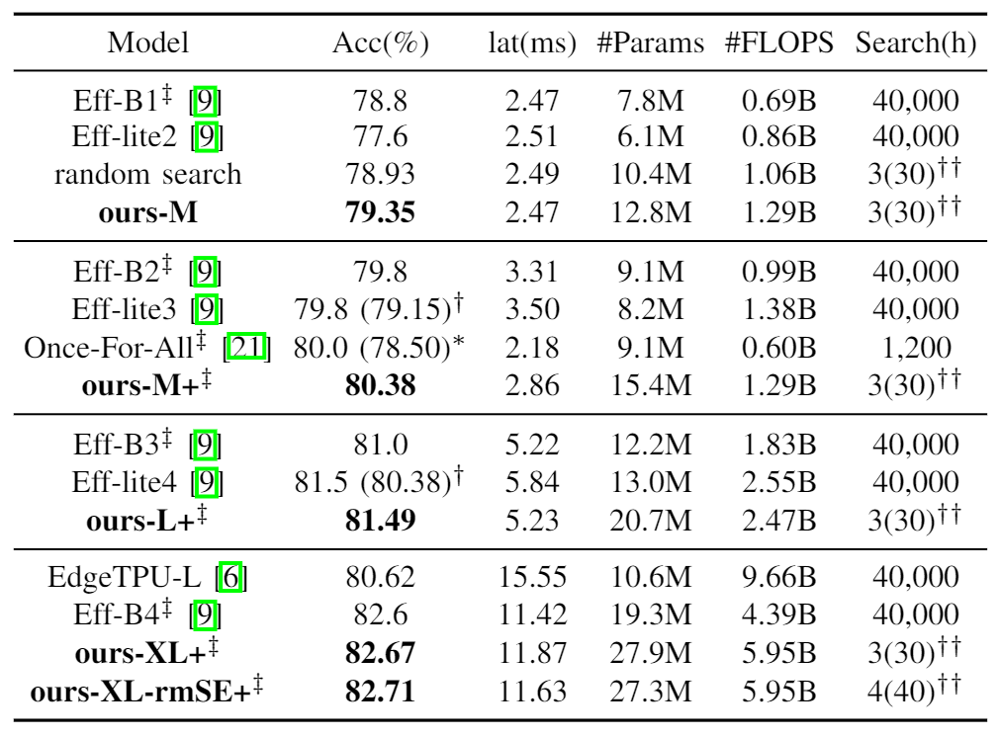

# [S<sup>3</sup>NAS](https://arxiv.org/abs/2009.02009): Fast NPU-aware Neural Architecture Search
We conduct NAS Following three steps : **S**upernet design, **S**ingle-Path NAS with modification, **S**caling and post-processing.

<p align="center">  </p>


## Results
We share our weight and model files at [google drive](https://drive.google.com/drive/folders/1XcakQe1pgvOFKXruKIeTghWwKnr0Oalr?usp=sharing).

<p align="center">  </p>


## Requirements
* Access to Cloud TPUs ([Official Cloud TPU Tutorial](https://cloud.google.com/tpu/docs/tutorials/mnasnet))
* Tensorflow 1.15.3 for TPU, 1.13 for GPU
* Python 3.5+
* python-box 3.4.6

### Usage

1. Set up ImageNet dataset

    To setup the ImageNet follow the instructions from [here](https://cloud.google.com/tpu/docs/imagenet-setup)  
    
    Or you can just copy from other bucket using `gsutil -m cp -r`, or transfer from other bucket.

2. Set up the profiled latency files
    ```
    latency_folder
    |-- Conv2D
    |-- Dense
    |-- GlobalAvgPool
    |-- MBConvBlock
    |-- MixConvBlock
        |-- r1_k3,5_s22_e2,4_i32_o32_c100_noskip_relu_imgsize112
        |-- ...
    ```
    each latency file contains a dictionary with latency value. For example, the content of
    `r1_k3,5_s22_e2,4_i32_o32_c100_noskip_relu_imgsize112` may be `{"latency": 364425}`
    
    For blocks, imgsize indicate width/height of input image of the block. Activation function is set to be relu as default. For more information, refer [latency_estimator.py](graph/latency_estimator.py) and [blockargs.py](graph/blockargs.py).
    
    For other components, the file name rule is similar, you can refer to `get_str` ftns of each BasicOps. refer [block_ops.py](graph/block_ops.py)
    
    to use our profiled latency files for MIDAP, please type
    ```
    git submodule update --init --recursive
   ```
    
3. Set up flags and run

    Refer to the script files in base_experiment_scripts, or set up flags yourself.
    When you use scripts in base_experiment_scripts, please MODIFY
    * Google Cloud Storage Bucket
    * Model file name
    * Google Cloud TPU name
    * Target latency
    * Latency folder name `--constraint_lut_folder=XXX`
    
    We provide script templates for NAS / train / post_process

4. Run the script file.

### Note
* When running on Multi-GPU, set `--moving_average_decay=0.0`
    
    Multi-GPU in TF 1.x does not support tf.train.ExponentialMovingAverage. [refer](https://github.com/tensorflow/tensorflow/issues/27392)

* When running on GPU, set `--use_tpu=False --transpose_input=False`

* Setting `--use_cache=False` can reduce memory usage.

* We didn't check the validity on GPU environment.

### Citation
If it helps your research, please cite
```
@misc{lee2020s3nas,
    title={S3NAS: Fast NPU-aware Neural Architecture Search Methodology},
    author={Jaeseong Lee and Duseok Kang and Soonhoi Ha},
    year={2020},
    eprint={2009.02009},
    archivePrefix={arXiv},
    primaryClass={cs.LG}
}
```
